MOS（金属氧化物半导体 Metal-Oxide-Semiconductor）  

N型MOS管
- Gate端连接了高电平，晶体管导通，电流从源（Source）流到漏（Drain）

P型MOS管
- Gate端连接了低电平，晶体管导通，电流从源（Source）流到漏（Drain）

# 第三讲 算术逻辑单元


非门


与门
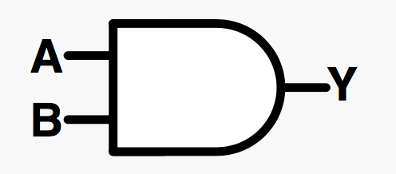

或门


异或门
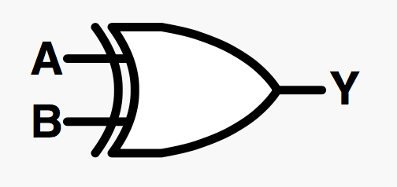  

寄存器由32个D触发器构成
>D触发器

>原理

>逻辑运算的实现
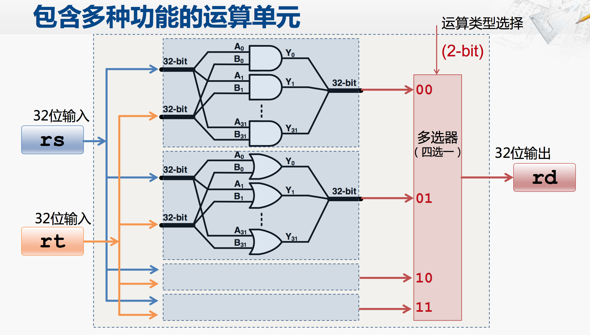

## 加减法的实现

半加器
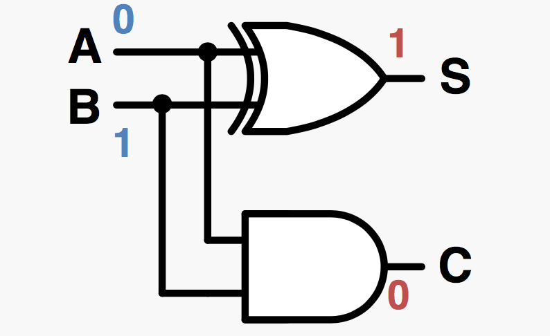

全加器  


加法的实现(行波进位加法器)
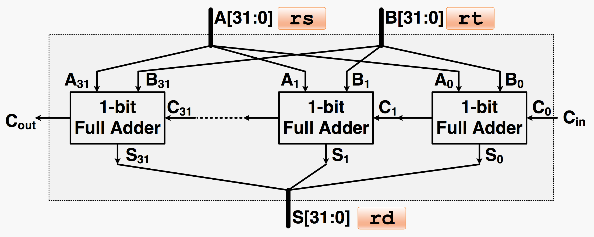

溢出的检查方法  
>“最高位的进位输入“不等于”最高位的进位输出“  
>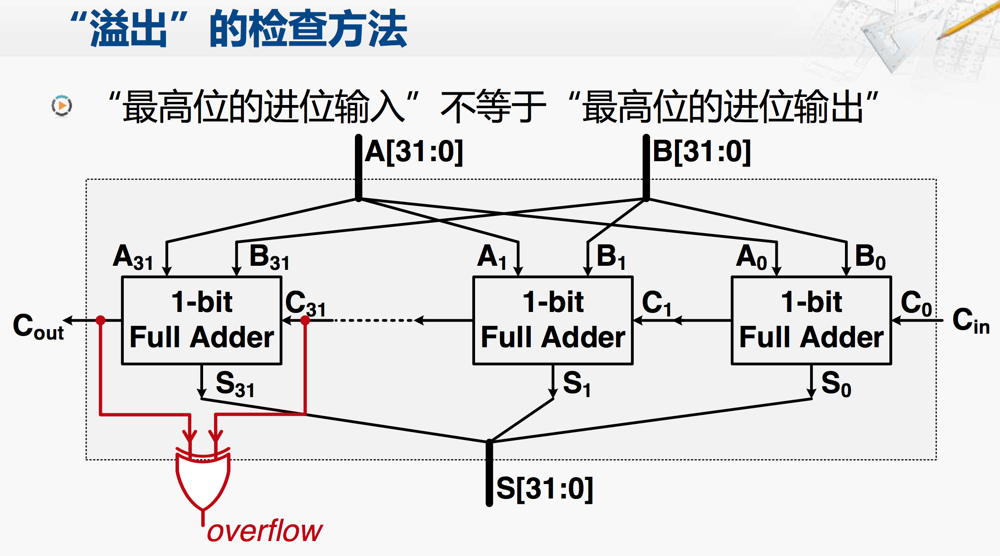

减法的实现  
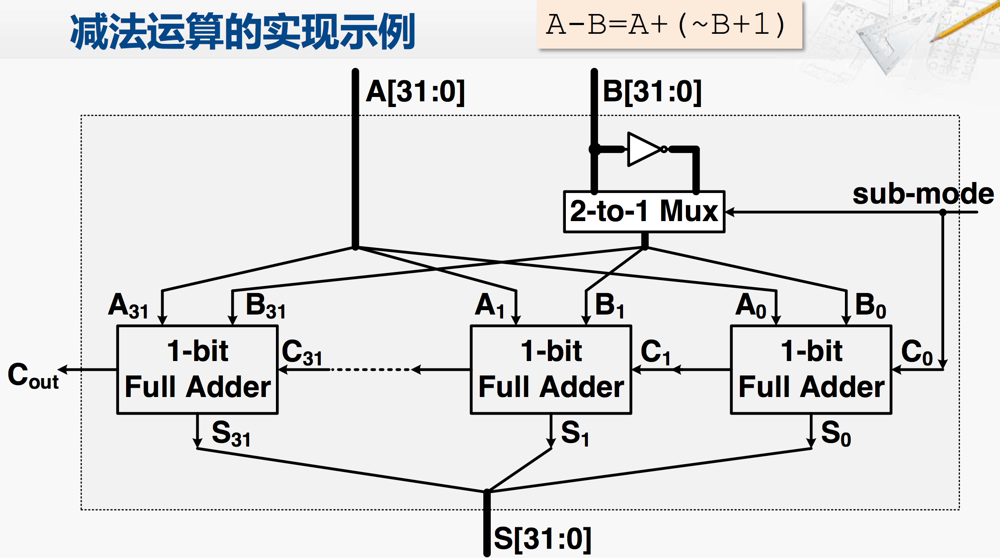  

行波进位加法器
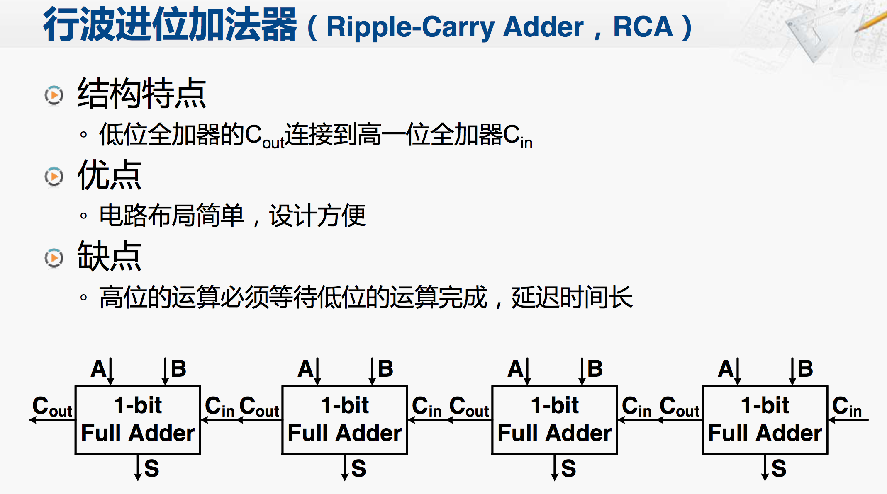
关键路径  
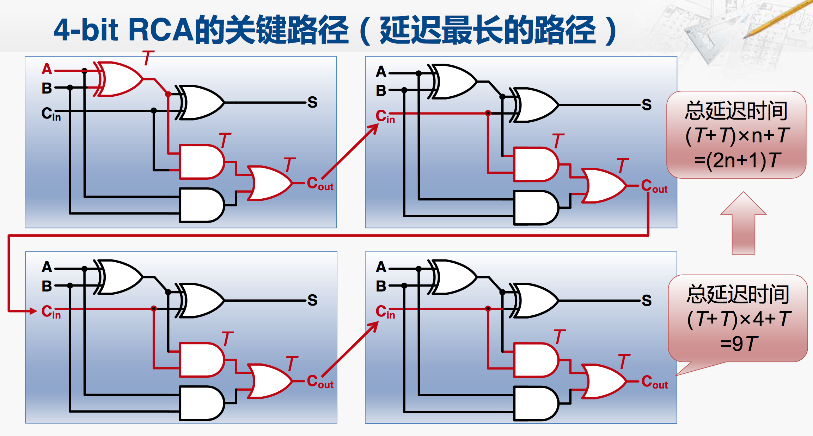  

进位输出信号的分析
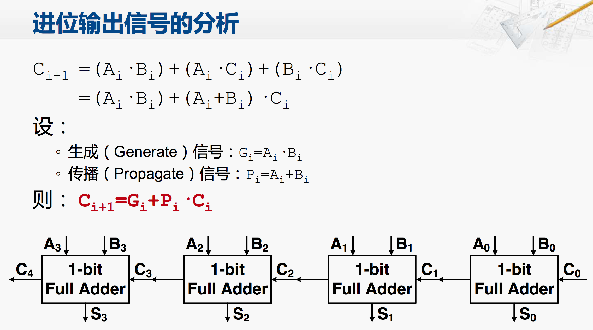
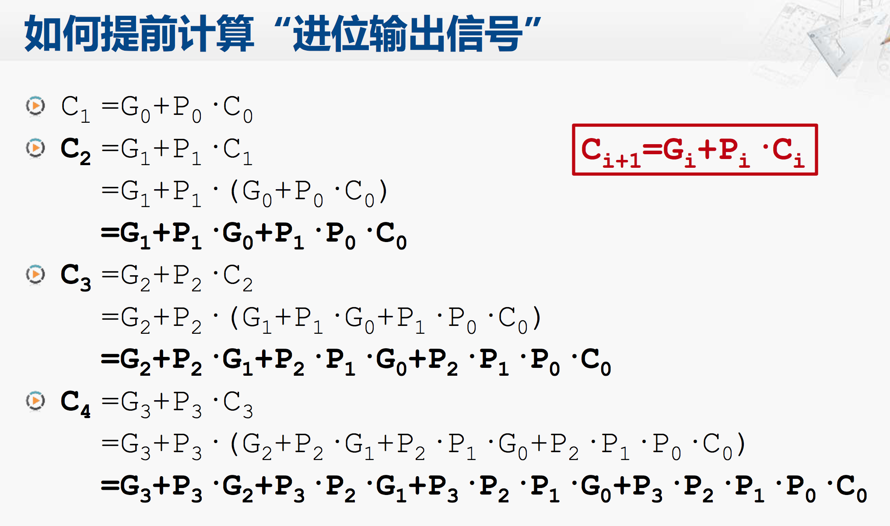
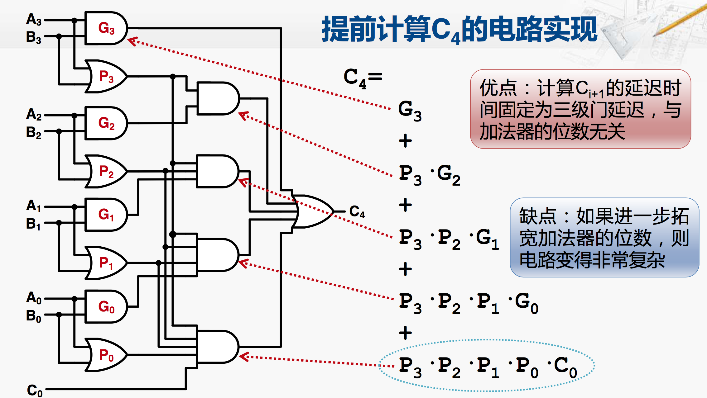


4级CLA的延迟时间为13T  
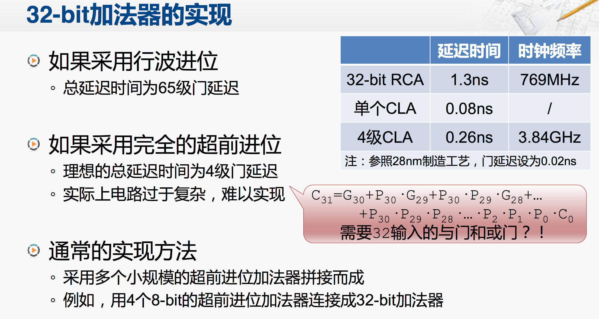

# 第四讲 乘法器和除法器 //TODO


# 第五讲 单周期处理器 //TODO
处理器设计的五个步骤
1. 分析指令系统，得出对数据通路的需求
2. 为数据通路选择合适的组件
3. 连接组件建立数据通路
4. 分析每条指令的实现，已确定控制信号
5. 集成控制信号，形成完整的控制逻辑

控制信号的集成//TODO

# 第六讲 流水线处理器

流水线，超标量；双发射，5级流水线

## 结构冒险

主存遵从冯诺依曼结构，同时存放数据和指令；一级缓存分别存放数据和指令，即IMem和DMem，这样就不会产生结构冒险的问题。

对于寄存器堆来说，他也会产生结构冒险的问题，比如同时执行指令译码阶段（ID)的读和写回阶段（WB）写，而这可以利用寄存器的特性来避免。

因为寄存器的周期比其他部件小，设为二分之一，那么只要使其在前二分之一的周期写，后二分之一的周期读，并设置独立的读写接口。

## 数据冒险

举例：
```mipsasm
sub $t0,$s1,$s2
add $s3,$t0,$s4
```

add指令需要sub的完成以利用$t0


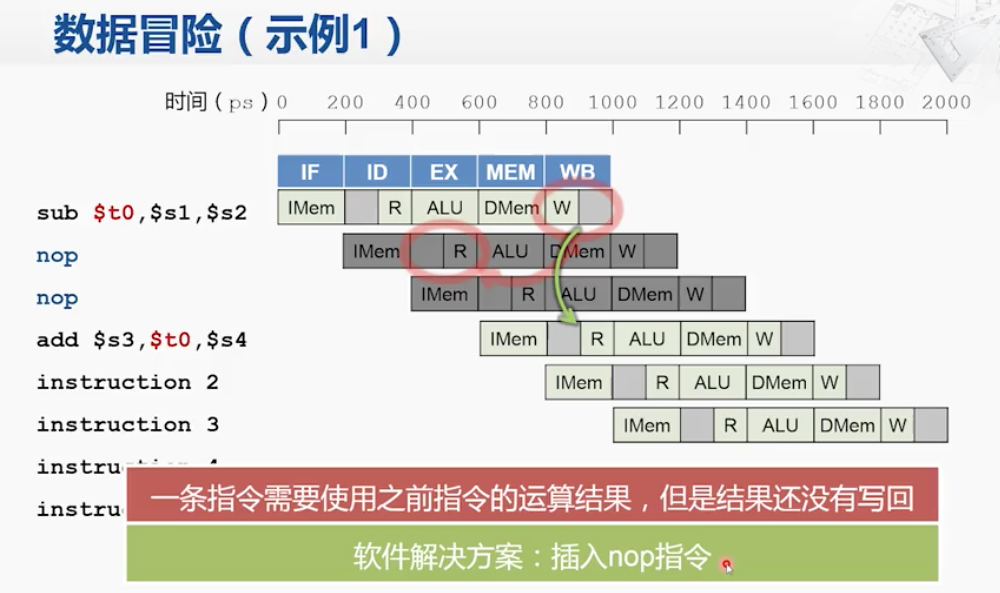


Load-Use Hazard

我们可以：
1. 让流水线停顿（stall），产生空泡（bubble）
    - 即一条指令需要使用之前指令的运算结果，但是结果还没有写回
2. 插入nop指令（软件层面解决问题）
    - 缺点：与处理器结构相关，当前处理器的流水线是5级的，新处理器的流水线是8级的，这一调换就会产生错误。
3. 数据前递（Forwarding），又称旁路（Bypass），寄存器直通（register forwarding），转发机制

## 控制冒险

在branch指令的第二条指令的取指阶段，由于并不知道上一条指令结束后是否发生分支（ALU产生的zero信号），就无法确定取指的地址，这就造成了控制冒险。

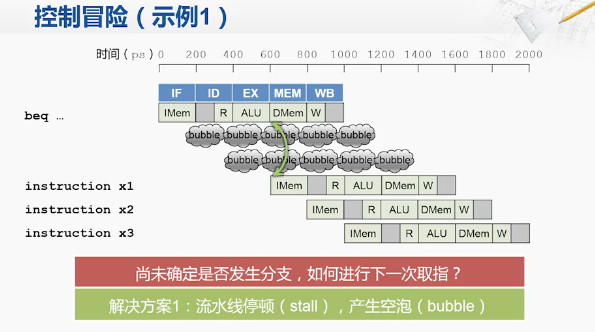
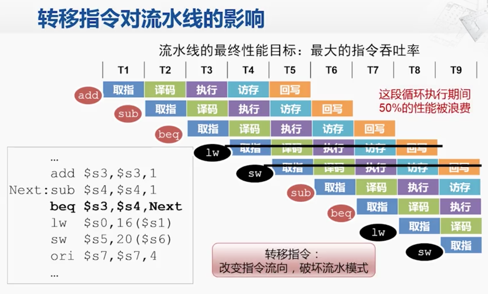
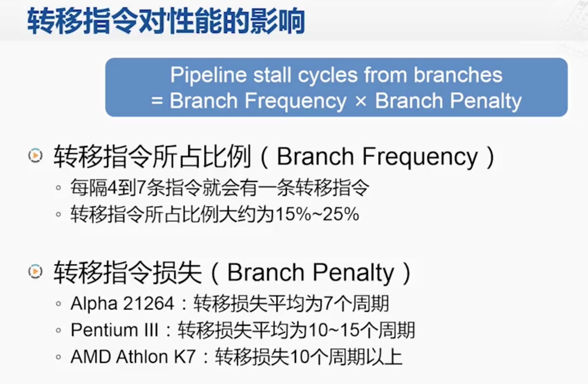

直接转移
- j Target
    - J型指令，前6位opcode,后26位address
    - New PC = {(PC + 4)[31..28], address, 00}
    - 所需信息在取指阶段即可获得，流水线不停顿

- beq rs, rt, imm16
    - I型指令，前6位opcode，5位rs，5位rt，16位立即数
    ```vb
    if(R[rs]-R[rt] == 0)
        then New PC = PC + 4 + SignExt[imm16] * 4;
        else New PC = PC + 4;
    ```
    - 执行阶段才能完成转移条件的判定（流水线停顿2周期）
        - 为了判断rs和rt是否相等而使用了ALU
    - 在寄存器堆的输出端增加额外的比较电路（流水线停顿1周期）
        - 由于判断寄存器相等比较简单，执行速度也非常快，所以可以做以上的硬件改动

间接转移
- jr rs
    - R型指令，前6位opcode,5位rs，5位rt，5位rd，5位shamt，6位funct
    - New PC = R[rs]
    - 译码阶段才能获得转移目标地址（流水线停顿1周期）

总结以上控制冒险的影响
- 无条件直接转移： j Target
    - 流水线无停顿
- 无条件间接转移： jr rs
    - 流水线停顿1个周期
- 条件转移： beq rs,rt,imm16
    - 流水线停顿1个周期

延迟转移技术
- 选择一条与条件转移指令无关的指令放到其后面，这样流水线就不用停顿，也不用废弃相关指令

我们可以：
1. 让流水线停顿（stall），产生空泡（bubble）
    - 这次我们产生两个空泡，等到ALU产生zero信号

# 第七讲 存储层次结构//TODO
存储器的特性
- 非易失性
    - 易失性存储器：CPU（通用寄存器），主存
    - 非易失性存储器：硬盘，BIOS芯片
- 可读可写
    - 可读可写 主存和硬盘
    - 只读 BIOS
- 随机访问
    - 随机访问 主存和BIOS
    - 不支持 硬盘
- 访问时间
- 容量
- 价格
- 功耗

计算机启动顺序：CPU->BISO->硬盘->内存

内存交互：CPU <-> Cache(SRAM) <-> Memory(DRAM)

DRAM和SRAM的比较
| | DRAM | SRAM |
| --- | --- | --- |
| 存储单元 | 电容 | 双稳态触发器 |
| 集成度 | `高` | 低 |
| 功耗 | `低` | 高 |
| 价格 | `低` | 高 |
| 速度 | 慢 | `快` |
| 刷新 | 有 | `无` |

## 主存的工作原理
DRAM芯片已一个存储阵列（Memory）为核心，这个阵列以行列的形式组织，行列的焦点就是一个存储单元，每个存储单元由一组唯一的行列地址指定，而储存单元通常由若干个比特构成，常见的有4bit和8bit。

内存条通常由8个内存芯片焊接在一块电路板上构成一个内存模组（Memory Module），因此从外部给出了行地址和列地址之后，这些地址会同时送到每一个DRAM芯片，从而在每个内存芯片中选中对应的存储单元， 假如存储单元内含8bit，那可以同时向外传送64个bit

1. BUS REQUEST
    - 当CPU需要访问存储器时，首先申请系统总线
    - 地址发往内存控制器
2. [Precharge] and Row Access
    - 内存控制器将地址分为行地址和列地址等多个部分，然后进行访存操作
    - 预充电和行访问
    - 通过存储总线发出的行地址会被行译码器（Row Decoder）所接收到，就会在存储阵列中选中对应的那一行，然后这一行所有的存储单元都会被放大（Sense Amplifiers）后放到缓冲区中。而这被称为激活（ACT(Activate)）或者行访问（RAS(Row Access Strobe)）
3. Column Access
    - 通过存储总线发出的列地址会被列译码器（Column Decoder）所接收到 
    - 从缓冲区中选出对应的那个数，被选中的数就会送到IO接口上去。而这被称为READ或者列访问（CAS(Column Access Strobe)）
    - 一般一次读一行
4. Bus Transmission
    - 内存控制器采样对应的数据,再送到CPU中去
    - 若下次访问的是同一行，则直接列访问从缓冲区中取数据就可以
    - 若不是这一行，就需要把激活的这一行关闭，这个过程称为预充电（Precharge，PRECH）
    - 预充电可以有两种方式
        - 再次访问时发现不在同一行，预充电
        - 每次传出数据时都预充电

tRCD:Row to Column Delay
- 从行选到列选的延迟时间
- 2-3个周期

CL:CAS Latency
- 从列选到数据输出的延迟周期
- 2-3个周期

tRP:RAS Precharge
- 行预充电（关闭行）
- 2-3个周期

`为什么在最后一个数据送出之前发出预充电的命令？`

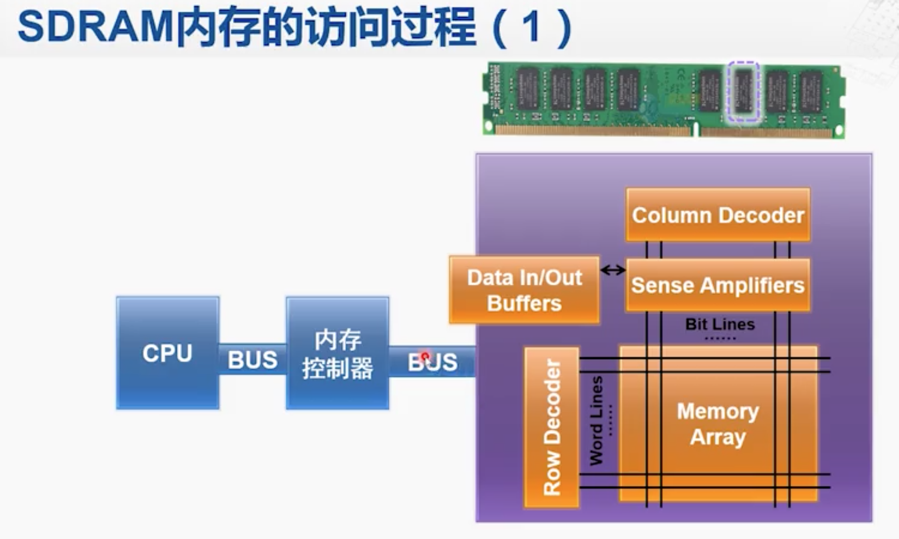
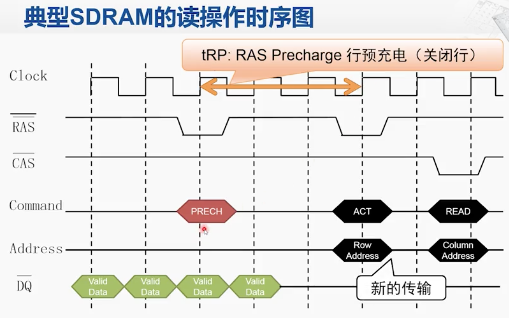
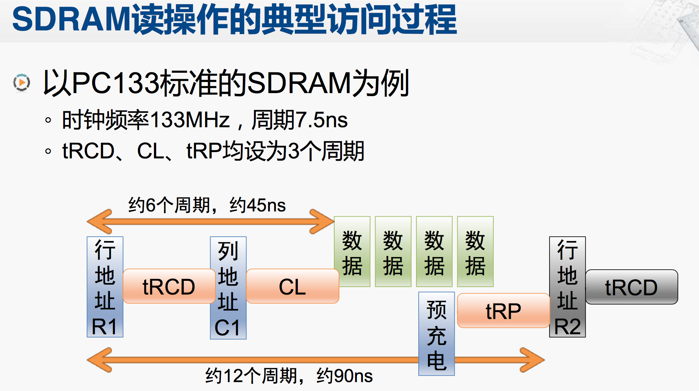

## 主存技术的发展
内存的传输带宽
> - DDR3-1600
> - 传输带宽12.8G/Hz
> - 1600MHz * 64bit/8

SDR（单倍数据率）
- 每次访问存储阵列取出单倍的数据量
- 每个时钟的上升沿传输数据，接收端也用时钟的上升沿采样数据

DDR（双倍数据率）
- 每次访问存储阵列取出两倍的数据量
- 在时钟的上升沿和下降沿都传输数据
- 这只是一种传输方式，应用到内存上就是DDR SDRAM，也可以用到其他领域

`核心频率和等效频率之间的关系`
`访存延迟和访存带宽`

DDR2（四倍数据率）
- 每次访问存储阵列取出四倍的数据量
- 在时钟的上升沿和下降沿都传I/O
- I/O频率为两倍

DDR3（八倍数据率）
- 每次访问存储阵列取出八倍的数据量
- 在时钟的上升沿和下降沿都传输数据
- I/O频率为四倍

通过DDR技术，带宽得到了大幅提升，而延迟的进步却很有限
- 1999年到2008年，行选时间（tRCD）延迟只降低了30%
- 而列选时间（CL）延迟也只降低了30%
- 存储器性能（DRAM）性能增长不到10倍
 
这是由SDRAM的基本单元结构决定的，也就是电容的充放电过程，如果不做材料的优化和改变，基于现在的SDRAM结构，想要优化和提升是很困难的

## 高速缓存的工作原理
1. 计算机程序从时间和空间都表现出“局部性”
2. 时间局部性（Temporal Locality)
    - 最近被访问的存储器单元很快还会被访问
3. 空间局部性（Spatial Locality）
    - 正在被访问的存储器单元附近的单元很快会被访问

Cache对空间局部性的利用
- 从主存中取回待访问数据时，会同时取回与位置相邻的主存单元的数据
- 以数据块（Block）为单位和主存进行数据交换

Cache对时间局部性的利用
- 保存近期频繁被访问的主存单元的数据

经典例题
- `循环通常具有很好的时间局部性`
- `循环通常具有很好的空间局部性`
- `数组通常具有很好的空间局部性`

Cache的访问过程：Cache命中（Cache Hit），Cache失效（Cache Miss）

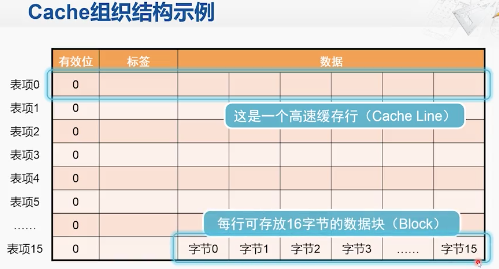

`Cache取数据块时读内存的地址是16字节对齐`

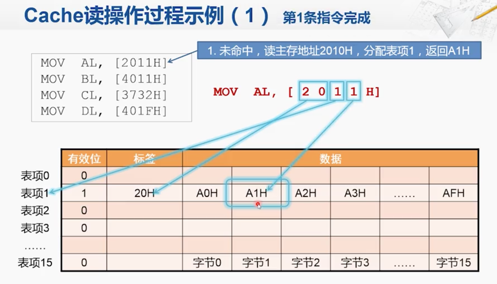

Cache的写策略：
- “Cache命中”时的写策略
    1. 写穿透（Write Through）：数据同时写入Cache和主存
    2. 写返回（Write Back）：数据只写入Cache，仅当该数据块被替换时才将数据写回主存

- “Cache失效”时的写策略
    1. 写不分配（Write Non-Allocate）：直接将数据写入主存
    2. 写分配（Write Allocate）：将该数据所在的块读入Cache后，再将数据写入Cache

## 高速缓存的设计要点
命中率（Hit Rate）和失效率（Miss Rate）

命中时间（Hit Time）
- 从Cache将命中数据返回的时间
- L1 Cache约1-3个周期
- L2 Cache约5-20个周期

失效代价（Miss Penalty）
- 从主存读取数据并返回的时间
- 约100-300个周期

平均访存时间Average Memory Access Time = Hit Time + Miss Penalty * Miss Rate

Cache失效的原因
1. 义务失效（Compulsory Miss） 第一次访问数据块时，也称冷启失效（Cold Start Miss）
2. 容量失效（Capacity Miss） Cache无法保存程序访问时所需的所有数据块
3. 冲突失效（Conflict Miss） 多个存储器位置映射到同一Cache位置

Cache的映射策略
> 解决冲突失效
- 直接映射Cache
- `二路组相连Cache`
- `四路组相连Cache`

常见的Cache替换算法
- 随机（Random)
    - 硬件随机选择一个Cache块替换
- 轮换（Round-Robin）
    - 按照预先设定的顺序依次选择Cache块替换
- 最近最少使用（LRU）
    - 硬件记录访问历史信息
    - 选择距离现在最长时间未被访问的Cache块替换

`分为数据和指令Cache的原因在于解决这两者局部性冲突`

### 存储容量的计算
K:2^10, M:2^20, G:2^30, T:2^40

MB和MiB

# 第八讲 中断和异常//TODO

第一个带有异常处理的系统：UNIVAC，1951年
* 算术运算溢出时：转向地址0执行`两条修复指令`，或者停机

第一个带有外部中断的系统：DYSEAC，1954年
* 有两个程序计数器（PC），根据I/O信号进行切换

1. 在程序运行时，系统外部、内部或现行程序本身出现需要特殊处理的“事件”
2. CPU立即强行中止现行程序的运行，改变机器的工作状态并启动相应的程序来处理这些“事件”
3. 处理完成后，CPU恢复原来的程序运行

8086的主要特点：
1. 对外有16根数据线
    * 内部有四个16位通用寄存器，既能处理16位数据，也能处理8位数据
2. 对外有20根地址线，可寻址的内存空间为1MB
3. 物理地址的形成采用“段加偏移”的方式
4. 存储器中保留两个专用区域
    * 中断向量表区：00000H~003FFH（地址最低的1KB）
        * 存放256个中断向量(中断服务程序的入口地址)，每个占4个字节单元
        * 每个中断类型对应一个中断向量（4字节）
        * 前两个字节存放入口地址的`偏移量（IP）`，后两个字节存放入口地址的`段基值（CS）`
        * CS左移4位 + IP = 物理地址
        * CS和IP类似于PC寄存器
    * 初始化程序区：FFFF0H~FFFFFH（地址最高的16B）
    

指令的寻址
* 实模式 CS:IP
* 保护模式 CS:EIP
    * 保护模式下，段基址不在CS中，而是在内存中
    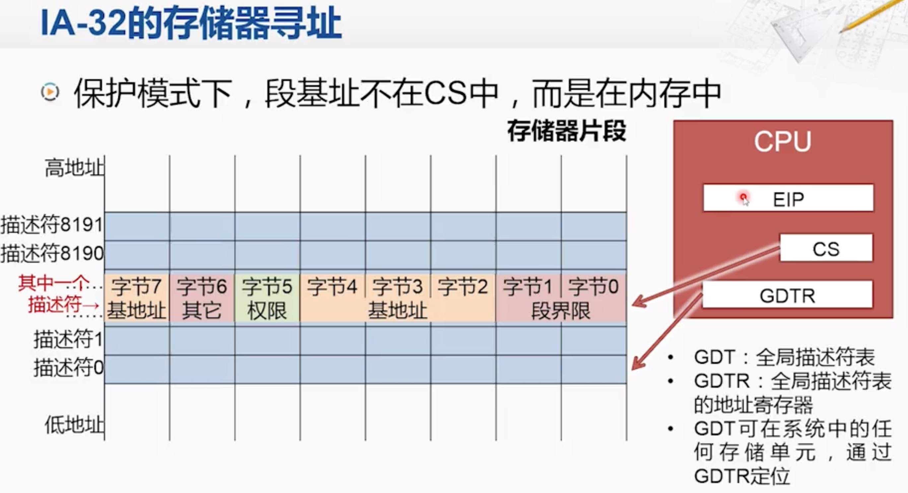
    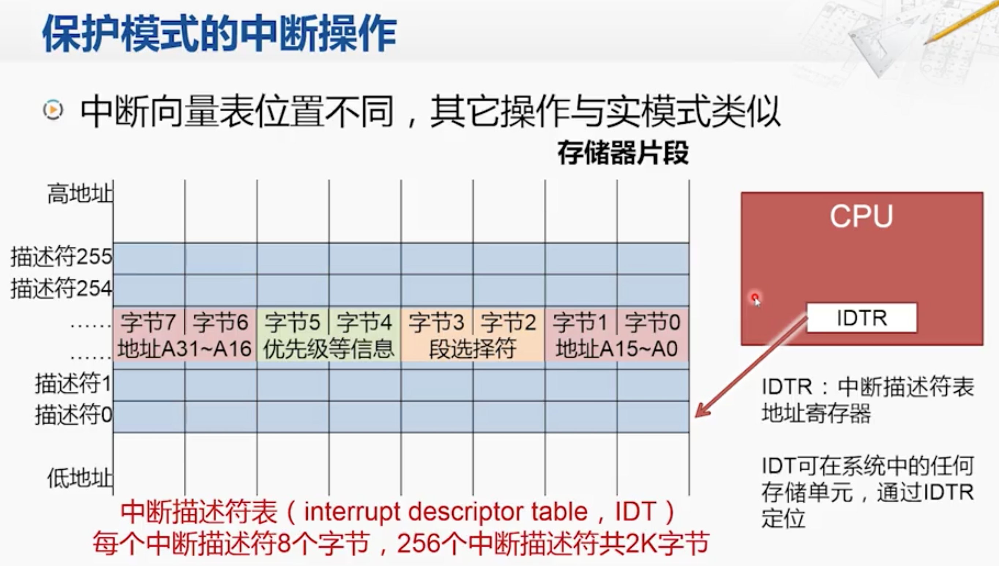

## 中断的处理过程
1. 关中断
    * CPU关闭中断响应，即不再接收其他外部中断请求
2. 保存断点
    * 将发生中断处的指令地址压入堆栈，以使中断处理完后能正确地返回
3. 识别中断源
    * CPU识别中断的来源，确定中断类型型号，从而找到相应的中断服务程序的入口地址
4. 保护现场
    * 将发生中断处的有关寄存器（中断服务程序中要使用的寄存器）以及标志寄存器的内容压入堆栈
5. 执行中断的服务程序
    * 转到中断服务程序入口开始执行，可在适当时刻重新开放中断，以便允许响应较高优先级的外部中断
        * 设置标志寄存器（FLAGS）中的中断标志IF，1为允许CPU响应`可屏蔽中断请求`，0为不允许
            * STI设置IF为1
            * CLI设置IF为0
6. 恢复现场，返回主程序继续运行
    * 把”保护现场“时压入堆栈的信息弹回原寄存器，然后执行中断返回指令，从而返回主程序继续运行
        * IRET指令（中断返回）
        * 从栈顶弹出3个字分别放入IP、CS和FLAGS寄存器
        * 扩展：IRETD指令，IRETQ指令

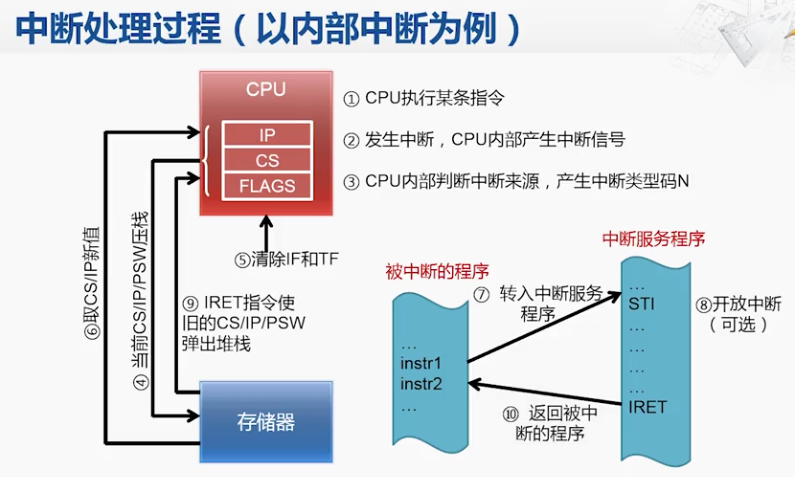

## 内部中断的分类说明

`除法错中断`也被称为`除0中断`（类型0）
* 在执行除法指令后，若所得的商超出了目标寄存器所能表示的范围，比如用数值0作除数，则CPU立即产生一个类型0中断

`溢出中断`（类型4）
* 执行INTO指令时，若溢出标志为OF为1，则将引起类型为4的内部中断
* 执行INTO指令时，若溢出标志为OF为0，则INTO指令执行空操作
* INTO指令通常安排在算术运算指令之后，以便在发生溢出时能及时处理
* INTO指令等同于指令INT 4

```x86asm
ADD AX, BX
INTO
```
`单步中断`（类型1）
* 当标志寄存器的TF（跟踪标志）置为1之后，CPU便处于单步工作方式
* 在单步工作方式下，CPU每执行完一条指令，就会自动产生一个类型1中断，进入类型1中断服务程序

`断点中断`（类型3）
* 在所有INT n形式的指令中，只有断点中断指令INT 3是一条单字节长的指令，其他都是两字节指令
* 因为在实际调试中，INT 3指令会代替要调试的指令，一个指令的最小长度为一个字节，而为了避免代替过之后剩余的指令产生偏移，必须设置成最小长度。

### 内部中断的特点

* 中断类型号
    * 内部中断的类型号由CPU内部产生
    * 外部中断则需要从外设读取中断类型号

* 屏蔽方式
    * 除单步中断外，所有内部中断都不可以用软件方法来禁止（屏蔽）
    * 单步中断可通过软件将TF标志置1或清0来允许或禁止

* 优先级
    * 除单步中断外，所有内部中断的优先级都比外部中断高

## 基于中断的功能调用

INT n指令说明
* x86系统提供的直接调用中断服务程序的手段
* n为0~255中的某一个数，对应中断类型码
* 操作
    1. 将FLAGS寄存器的内容压栈
    2. 清除中断标志IF和单步标志TF
    3. 将CS和IF寄存器的内容压栈
    4. 根据中断类型码查找中断向量表，取得对应中断服务程序的入口地址
    5. 将入口地址分别装入CS和IP寄存器

1. 溢出中断
2. BIOS中断
    ```x86asm
    MOV AH,1    ;设置功能号，对于1AH号中断，AH=1为”置时钟“
    MOV CX,0    ;设置入口参数，CH:CL=时：分
    MOV DX,0    ;设置入口参数，DH:DL=秒：1/100分
    INT 1AH     ;调用1AH号中断
    ```
3. DOS中断
    * 包含常用的功能程序，分别实现文件管理、存储管理、作业管理和设备管理等功能
    * 共用21H号中断入口，通过传参数的方式设置功能号，以选择执行不同功能模块的代码
    * 说明
        * DOS中断功能比BIOS中断更齐全、完整
        * 进一步屏蔽了设备的物理特性及其接口特性
    ```x86asm
    MOV AH,6    ;设置功能号，DOS中断6号功能为屏幕输入输出
    MOV DL,'$'  ;设置入口参数，DL中放置待输出的字符
    INT 21H     ;调用DOS中断
    ```

# 第九讲 输入输出设备

## 输入输出接口的基本功能
1. 数据缓冲
    * 解决CPU和外设之间的速度差距
2. 提供联络信息
    * 协调与同步数据交换过程
3. 信号与模拟信号格式的转换
    * 模/数、数/模转换、串/并、并/串转换，电平转换
4. 设备选择
5. 中断管理
6. 可编程功能

显卡、南桥芯片、并行接口电路

## 输入输出接口的编址方式
I/O端口
* I/O接口内部包含一组称为`I/O端口`的寄存器
* 每个I/O端口都需有自己的`端口地址`（或称端口号），以便CPU访问

常见的I/O端口编址方式
* I/O端口和存储器分开编址
    * I/O Mapped I/O
    * x86
* I/O端口和存储器统一编址
    * Memory Mapped I/O
    * ARM，MIPS，POWER PC

I/O端口和存储器分开编址(x86指令)
* IN指令（输入）
```x86asm
IN AC,PORT
```
* OUT指令（输出）
```x86asm
OUT PORT,AC
```
* 端口地址为0~255
    * 直接寻址，间接寻址（DX保存端口地址）
* 端口地址大于255
    * 间接寻址（DX保存端口地址）
* 通过`M/IO信号`去指定存储器寻址还是I/O接口寻址（=0）

I/O端口和存储器统一编址
* 优点
    * 可以利用为存储器开发的丰富的指令
    * 简化内部结构，减少CPU引脚
* 缺点
    * 存储地址空间减小
    * 指令执行时间长

I/O端口和存储器分开编址
* 优缺点与统一编址相对

## 输入输出的控制方式

I/O控制方式的含义：CPU如何控制外设的数据传送

I/O控制方式的分类
1. 程序控制方式
    1. 无条件传送方式
        * 简单外设
        * 优点：控制程序简单；缺点：只适用于简单外设
    2. 程序查询传送方式
        * CPU通过执行一段程序，不断查询外设的工作状态
        * 在确定外设已经准备就绪时，才进行数据传送
        * 控制寄存器->IO缓冲寄存器和状态寄存器
        * 优点：更准确和可靠；缺点：查询外设状态占用了大量的时间
    3. 共同的优缺点
        * 优点：对外设要求低，操作流程清晰
        * 缺点：由CPU进行数据传送操作，占用了宝贵的运算资源
2. 中断控制方式
3. 直接存储器访问（DMA）方式

## 中断控制方式

优点：
* CPU可以和外设并行工作，提高了工作效率
* 外围设备具有申请服务的主动权
* 一定程度上满足了I/O处理的实时性要求

缺点：
* 外设和存储器之间的数据交换仍由CPU承担
    * 使用数据传送指令，占用了宝贵的CPU运算资源
    * 数据要经过CPU中的通用寄存器中转，过程冗长
* 进入和退出中断服务程序，需要额外的指令

## 外部中断的处理过程

外部中断，也称硬件终端
* 由CPU外部的中断请求信号启动的中断

x86 CPU为外部中断提供两个引脚
* NMI：非屏蔽中断
    * 信号非常重要，不希望被屏蔽
* INTR：可屏蔽中断
    * 中断控制器连接多个外设
        * 可编程中断控制器：PIC
        * 高级可编程中断控制器：APIC

可屏蔽中断的处理过程
1. 外设发中断请求信号
2. CPU完成现行指令，发出中断响应信号
3. CPU读取中断类型码
4. 当前CS/IP/PSW压栈
5. 清除IF和TF
6. 取CS/IP新值
7. 转入中断服务程序
8. 开放中断（可选）
9. IRET指令使旧的CS/IP/PSW弹出堆栈
10. 返回被中断的程序

中断嵌套

## 直接存储器访问方式（DMA）

DMA
* 数据传送过程不需要CPU干预（不需要执行程序指令）
* 由专门硬件控制电路控制，进行外设与存储器间直接数据传送
* 该专门硬件控制电路称为DMA控制器，简称DMAC

DMAC的基本工作步骤
1. CPU设置DMAC内部配置寄存器
2. DMAC处于空闲等待状态
3. I/O接口向DMAC发出DMA传送申请
4. DMAC响应I/O接口的申请
5. DMAC向I/O接口发起总线读传输
6. DMAC向存储器发起总线写传输
7. 重复5~6直到本次DMA传送完成
8. 返回2，等待下一次DMA传送申请

DMAC的主要配置参数
* CPU设置DMAC内部配置寄存器，一般包括
    1. 源地址的初始值以及传送时地址增减方式
    2. 目的地址的初始值以及传送时地址增减方式
    3. 待传送数据的长度


阿塔纳索夫-贝瑞计算机（Atanasoff-Berry Computer，简称ABC）是法定的世界上第一台电子计算机，是爱荷华州立大学的约翰·文森特·阿塔纳索夫（John Vincent Atanasoff）和他的研究生克利福特·贝瑞（Clifford Berry）在1937年设计，不可编程，仅仅设计用于求解线性方程组，并在1942年成功进行了测试。

ENIAC是第二台计算机和第一台通用计算机。

 


