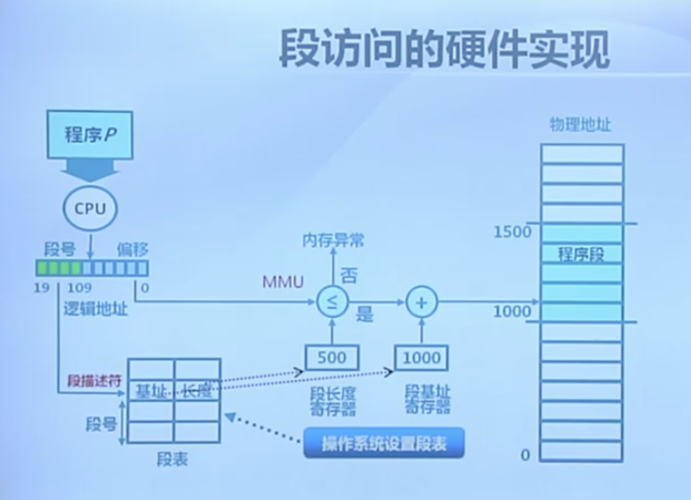
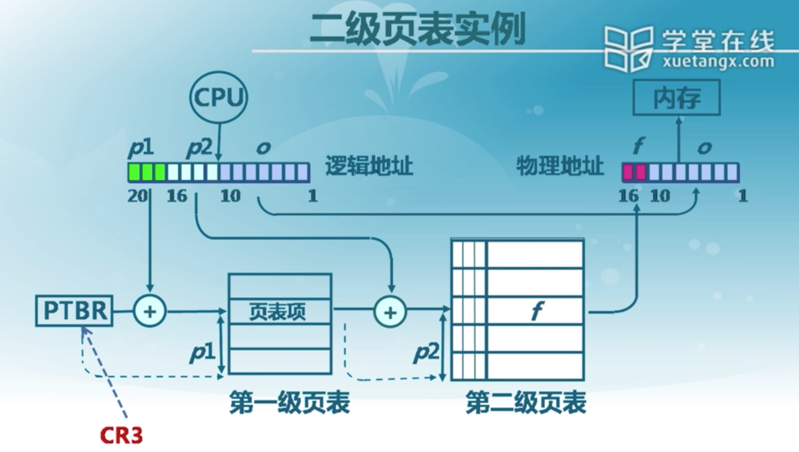
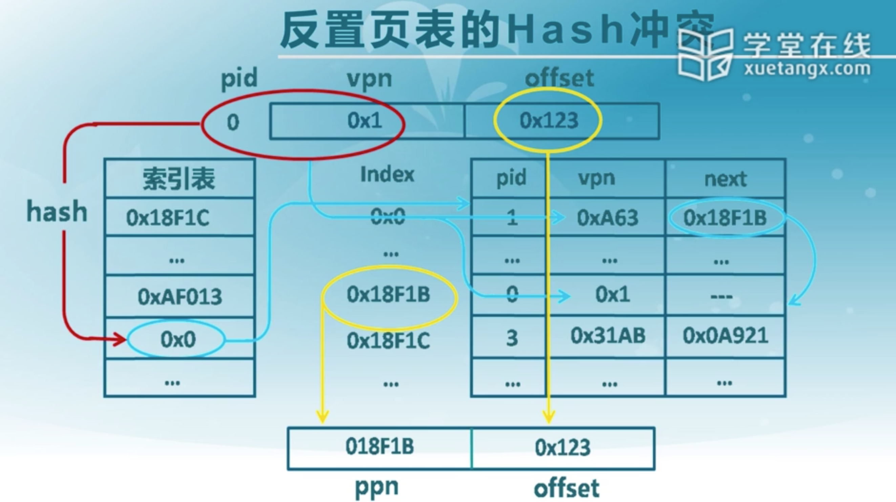
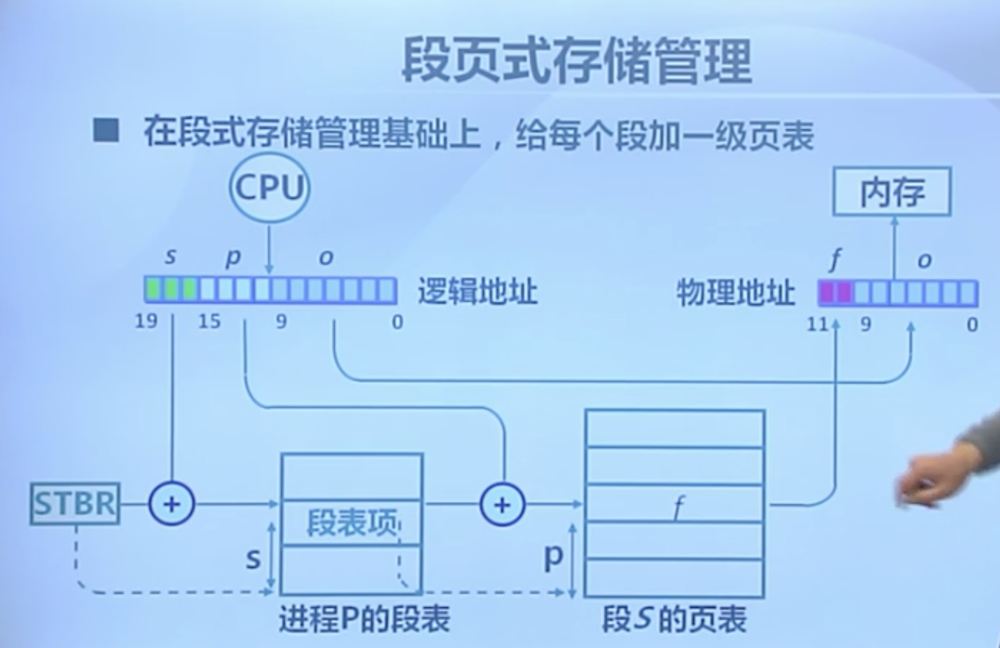
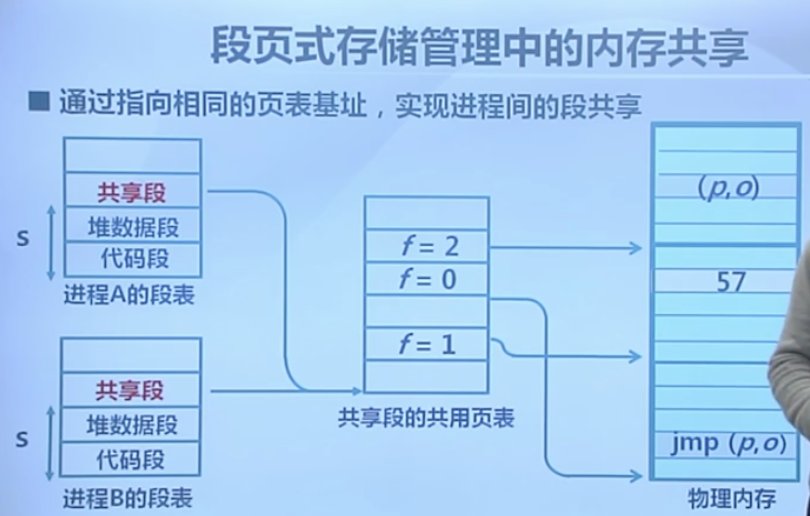
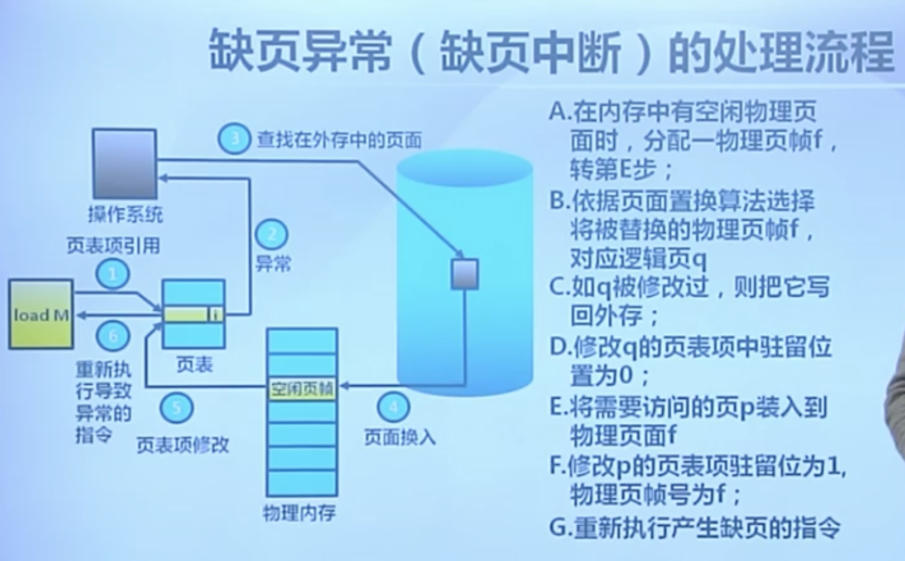
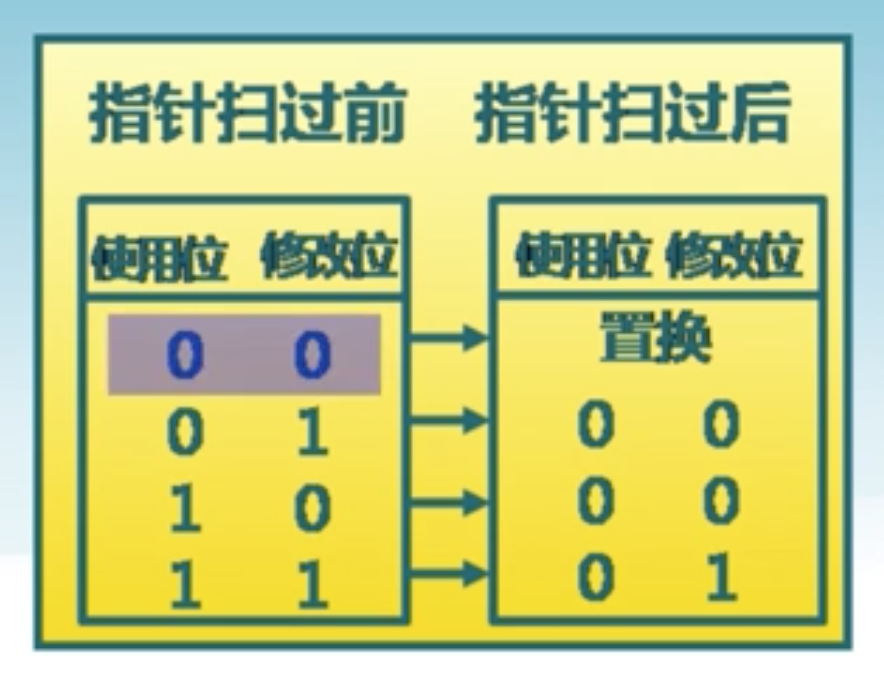
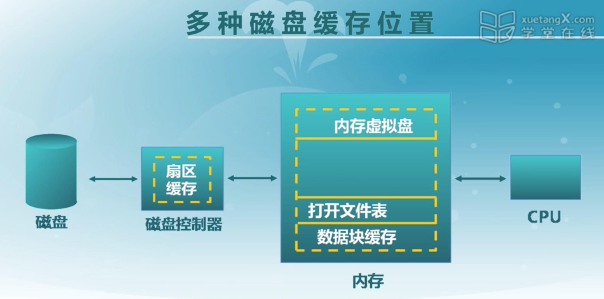

---
layout:default
title:清华OS笔记
---
1. **并发**是指两个或多个事件在同一时间间隔内发生。
- 注意同一时间间隔（并发）和同一时刻（并行）的区别。
- 举例：在多道程序环境下，一段时间内，宏观上有多道程序在同时执行，而在每一时刻，单处理机环境下实际仅能有一道程序执行，故微观上这些程序还是在分时地交替执行。
2. 计算机开机后，操作系统最终被加载到**RAM**
3. 我们把一段时间内只允许一个进程访问的资源称为**临界资源**或**独占资源**。
4. 批处理操作系统、分时操作系统和实时操作系统各有什么特点？
    1. 批处理操作系统的用户脱机使用计算机，作业是成批处理的，系统内多道程序并发执行，交互能力差
    2. 分时操作系统可以让多个用户同时使用计算机，人机交互性较强，具有每个用户独立使用计算机的独占性，系统响应及时。
    3. 实时操作系统能对控制对象作出及时反应，可靠性高，响应及时，但是资源利用率低。
4. 甘特图画出**逻辑控制流Logical Control Flow**图
5. 访管指令
6. 中断处理和子程序调用都需要压栈以保护现场，中断处理一定会保存而子程序调用不需要保存其内容的是**程序状态字寄存器PSW**
7. 程序状态字PSW有一系列标志位，典型的有IF（Interrupt Flag）。在一些计算机结构是**状态寄存器SR**和**程序计数器PC**的结合体。
8. 异常可以分为4类，中断(Interrupt)，陷阱(Trap)，故障(Fault)，终止(Abort)。
9. 典型的陷阱有read、fork、execve、exit，处理器提供了一条特殊的“syscall n”指令用以调用它们；典型的故障有缺页异常；典型的终止有DRAM或SRAM损坏时发生的奇偶错误
10. 对于x86-64系统而言，有高达256种不同的异常类型。其中0~32的号码对应Intel架构师定义的异常，因此对任何x86-64系统都是一样的；32~255的号码对应的是操作系统定义的中断和陷阱
11. 在x86-64系统中，Linux系统调用的参数通过**通用寄存器**而不是栈来传递。按照惯例，寄存器%rax包含系统调用号，寄存器**%rdi、%rsi、%rdx、%r10、%r8、%r9**包含参数，显然最多可有6个参数。当系统调用返回时**%rax**包含返回值，-4095到-1之间的负数表明发生了错误，对应于负的**errno**
12. **中断隐指令**：CPU响应中断之后，经过某些操作，转去执行中断服务程序。这些操作是由硬件直接实现的，被称之为中断隐指令。中断隐指令并不指指令系统中的一条真正的指令，它没有操作码，所以中断隐指令是一种不允许、也不可能为用户使用的特殊指令。其所完成的操作主要有：
    1. 保存断点
    2. 关中断
    3. 引出中断服务程序
13. 对于私有地址空间而言，代码段总是从0x400000开始，0~0x400000保留给内核
14. Linux提高了一种聪明的机制，叫做**/proc**文件系统，它允许用户模式进程访问内核数据结构的内容。你可以用它来找出系统属性，比如CPU类型(/proc/cpuinfo)，或者某个特殊的进程使用的内存段（/proc/<process-id>/maps)。2.6版本的的Linux内核引入**/sys**文件系统，提供关于系统总线和设备的额外信息。
15. **fork函数**只被调用一次，却会返回两次：一次在父进程中，一次在子进程中；返回给父进程子进程的pid，返回给子进程0。
16. 当一个进程由于某种原因终止时，内核并不是立即把它从系统中清除。相反，进程被保持在一种已终止的状态中，直到被它的父进程**回收(reaped)**。一个终止了但还未被回收的进程称为**僵死进程（zombie）**。
17. 如果一个父进程终止了，内核会安排init进程称为它的孤儿进程的养父。init进程的PID为1，是在系统启动时由内核创建的，它不会终止，是所有进程的祖先。
18. 一个进程可以通过调用**waitpid**函数来等待它的子进程终止或者停止。waitpid挂起调用进程的执行，直到它的**等待集合（wait set)**中的一个子进程终止。对于第一个参数pid而言，若针对特定子进程A，则其为A的pid；若针对全体子进程，则其为-1。第二个参数用于检查已回收子进程的退出状态。第三个参数用于修改waitpid的默认行为。第二、三个参数较为复杂，不赘述。
    ```c
    #include <sys/types.h>
    #include <sys/wait.h>

    pid_t waitpid(pid_t pid, int *statusp, int options);
    ```
19. **wait函数**是waitpid函数的简单版本，它等价于waitpid(-1, &status, 0)
    ```c
    #include <sys/types.h>
    #include <sys/wait.h>

    pid_t wait(int *statusp);
    ```
20. 命令行尾部的**&符号**表示命令在后台执行
21. **sleep函数**将一个进程挂起一段指定的时间
    ```c
    #include <unistd.h>

    unsigned int sleep(unsigned int secs);
    ```
22. **pause函数**使调用函数休眠，直到该进程收到了一个信号
23. **execve函数**在当前进程的上下文中加载并运行一个新程序
    ```c
    #include <unistd.h>

    int execve(const char *filename, const char *argv[],
                const char *envp[]);
    ```
24. 只有当出现错误时，execve才会返回到调用程序，否则决不返回。
25. fork与execve的区别
    - fork函数在新的子进程中运行相同的程序，新的子进程是父进程的一个复制品，只是pid不一样。execve函数在当前进程的上下文中加载并运行一个新的程序。它会覆盖当前进程的地址空间，但并没有创建一个新进程。新的程序仍然有相同的pid，并且继承了调用execve函数时已打开的所有文件描述符。
26. 四个原语：创建进程原语，终止进程原语，阻塞进程原语，唤醒原语
27. 分时系统采用时间片轮转发调度进程策略
28. 一个**进程实体**由程序段、相关数据段和PCB三部分构成
29. 进程通信（IPC,Inter-Process Communication）的方法有三个：共享存储，消息传递，和管道通信
    1. 两个进程共享空间必须通过**特殊的系统调用**来实现。
    2. 信息传递可以用**发送信息**和**接受信息**两个原语进行数据交换
    3. 管道通信是通过共享一个叫pipe的文件来实现，双方不能同时写或者读，因此只能采取**半双工通信**。
30. CPU繁忙型进程可以理解为短进程
31. 若某单处理器多进程系统中有多个就绪态进程，则下列关于处理机叙述正确的是
    ```
    A. 在进程结束时能进行处理机调度
    B. 创建新进程后能进行处理机调度
    C. 在进程处于临界区时不能进行处理机调度
    D. 在系统调用完成并返回用户态时能进行处理机调度

    ANSWER:C
    对于C，当进程处于临界区时，说明进程正在占用处理机，只要不破坏临界资源的使用规则，是不会影响处理机调度的。

    ```
32. “具有两道作业的批处理系统”就是说内存里面只能存放两道作业
### 同步互斥
33. 
- 互斥（mutual exclusion）：一个进程占用资源，其他进程不能使用
- 死锁（deadlock）：多个进程各自占用部分资源，形成循环等待
- 饥饿（starvation)：其他进程可能轮流占用资源，一个进程一直得不到资源
34. Peterson算法
    - 共享变量
        ```c++
        int turn;
        boolean flag[];
        ```
    - 进入区代码
        ```c++
        flag[i] = true;
        turn = j;
        while (flag[j] && turn == j)
        ```
35. Dekkers算法
36. N线程的软件方法（Eisenberg和McGuire)
37. 原子操作指令
    1. 现代CPU体系结构都提供一些特殊的原子操作指令
    2. 测试和置位（Test-and-Set）指令
        - 从内存单元中读取值
        - 测试该值是否为1（然后返回真或假）
        - 内存单元值设置为1
    ```c++
    boolean TestAndSet(boolean *target){
        boolean rv = *target;
        *target = true;
        return rv;
    }
    ```
    3. 交换指令（exchange）
        - 交换内存中两个值
38. 使用TS指令实现自旋锁(spinlock) 
   - 忙等待版本
        ```c++
        class Lock {
            int value = 0;
        }

        Lock::Acquire(){
            while(test-and-set(value))
                ; //spin
        }

        Lock::Release(){
            value = 0;
        }
        ```
    - 非忙等待版本
        ```c++
        class Lock{
            int value = 0;
            WaitQueue q;
        }

        Lock::Acquire(){
            while(test-and-set(value)){
                add this TCB to wait queue q;
                schedule();
            }
        }

        Lock::Release(){
            value = 0;
            remove one thread t from q;
            wakeup(t);
        }
        ```
### 信号量
39. 信号量的实现
    ```c++
    class Semaphore{
        int sem;
        WaitQueue q;
    }

    Semaphore::P(){
        sem--;
        int (sem < 0){
            Add this thread t to q;
            block(p);
        }
    }

    Semaphore::V(){
        sem++;
        int (sem <= 0){
            Remove a thread t from q;
            wakeup(t);
        }
    }

    Semaphore::V(){}
    ```
40. 信号量的分类
    - 二进制信号量：资源数目为0或1
    - 资源信号量：资源数目为任何非复值
41. 信号量的使用
    - 互斥访问：临界区的互斥访问
        ```c++
        mutex = new Semaphore(1);
        mutex->P();
        Critical Section;
        mutex->V();
        ```
    - 条件同步：线程间的事件等待。举例如下，线程A要在线程B之后才能运行
        ```c++
        condition = new Semaphore(0);

        //thread A
        condition -> P();

        //thread B
        condition -> V();
        ```
42. 生产者消费者问题
    1. 一个或多个生产者在生成数据后放在一个缓冲区里
    2. 单个消费者从缓冲区取出数据处理
    3. 任何时刻只能有一个生产者或消费者可访问缓冲区（互斥访问）
    4. 缓冲区空时，消费者必须等待生产者（条件同步）
    5. 缓冲区满时，生产者必须等待消费者（条件同步）
43. 生产者消费者问题的解决
    ```c++
    class BoundedBuffer{
        mutex = new Semaphore(1);
        fullBuffers = new Semaphore(0);
        emptyBuffers = new Semaphore(n);
    }

    BoundedBuffer::Deposit(c){
        emptyBuffers -> P();
        mutex -> P();
        Add c to the buffer;
        mutex -> V();
        fullBuffers -> V();
    }

    BoundedBuffer::Remove(c){
        fullBuffers -> P();
        mutex -> P();
        Remove c from buffer;
        mutex -> V();
        emptyBuffers -> V();
    }
    ```
### 管程（Monitor）
44. 管程是一种用于多线程互斥访问共享资源的程序结构
    - 采用面向对象方法，简化了线程间的同步控制
    - 任一时刻最多只有一个线程执行管程代码
    - 正在管程中的线程可临时放弃管程的互斥访问，等待事件出现时恢复
45. 条件变量（Condition Variable）：每个条件变量表示一种等待原因，对应一个等待队列
    - Wait()操作
        - 将自己阻塞在等待队列中
        - 唤醒一个等待者或释放管程的互斥访问
    - Signal()操作
        - 将等待队列中的一个线程唤醒
        - 如果等待队列为空，则等同空操作
46. 管程的实现
    ```cpp
    class Condition{
        int numWaiting = 0;
        WaitQueue q;
    }

    Conditon::Wait(lock){
        numWaiting++;
        Add this thread t to q;
        release(lock);
        schedule();//need mutex
        require(lock);
    }

    Condition::Signal(){
        if(numWaiting > 0){
            Remove a thread t from q;
            wakeup(t);//need mutex
            numWaiting--;
        }
    }
    ```
47. 用管程解决生产者-消费者问题
    ```cpp
    class BoundedBuffer{
        Lock lock;
        int count = 0;
        Condition notFull, notEmpty;
    }

    BoundedBuffer::Deposit(c){
        lock -> Acquire();
        while(count == n)
            notFull.Wait(&lock);
        Add c to the buffer;
        count++;
        notEmpty.Signal();
        lock -> Release();
    }

    BoundedBuffer::Remove(c){
        lock -> Acquire();
        while(count == 0)
            notEmpty.Wait(&lock);
        Remove c from buffer;
        count--;
        notFull.Signal();
        lock -> Release();
    }    
    ```
48. Hansen管程和Hoare管程
    - 对于Hansen管程而言，进程B发出signal之后，wait的进程A并不立即执行，而是在进程B出了缓冲区之后A才执行
    - 对于Hoare管程而言，进程B发出signal之后，wait的进程A立即执行，A出了缓冲区之后，B继续执行
49. Hansen管程和Hoare管程实现的区别
    ```c++
    Hansen-style:Deposit(){
        lock -> Acquire();
        while(count == n){
            notFull.wait(&lock);
        }
        Add thing;
        count++;
        notEmpty.signal();
        lock->release();
    }

    Hoare-style:Deposit(){
        lock -> Acquire();
        if(count == n){
            notFull.wait(&lock);
        }
        Add thing;
        count++;
        notEmpty.signal();
        lock->release();
    }  
    ```
    - 主要区别在count，对于Hansen管程而言，进程B发出了信号之后，继续执行，在执行的过程中，它可能会改变count，使得count继续为n，所以A要继续测试count == n。
    - 对于Hoare管程而言，进程B发出了信号之后，暂停执行，所以count一定不为n，所以A不用再测试，继续往下执行
50. 哲学家就餐问题
- 五个哲学家围绕一张圆桌而坐
    - 桌子上放着5只叉子
    - 每两个哲学家之间放一支
- 哲学家的动作包括思考和进餐
    - 进餐时需同时拿到左右两边的叉子
    - 思考时将两支叉子放回原处
```c++
#define N 5
semeaphore fork[5];
void philosopher(int i){
    while (TRUE){
        think();
        if(i%2 == 0){
            P(fork[i]);
            P(fork[(i + 1) % N]);
        }else{
            P(fork[(i + 1) % N]);
            P(fork[i]);
        }
        eat();
        V(fork[i]);
        V(fork[(i + 1) % N]);
    }
}
```
解决的主要问题是死锁，若是5个哲学家同时拿起左边的叉子，则陷入死锁。那么若不让他们拿起同一边的叉子，则不会出现那样的问题。在实现中，是通过每个哲学家的叉子的奇偶性来解决这一问题的。
51. 读者写者问题
- “读-读”允许
    - 同一时刻，允许有多个读者同时读
- “读-写”互斥
    - 没有写者时读者才能读
    - 没有读者时写者才能写
- “写-写”互斥
    - 没有其他写者时写者才能写
52. 读者写者问题的实现（写者优先，信号量版本）
    ```cpp
    //Writer
    P(WriteMutex);
    write;
    V(WriteMutex);

    //Reader
    P(CountMutex);
    //只有第一个读者需要申请写锁
    if (Rcount == 0) P(WriteMutex);
    ++Rcount;
    V(CountMutex);

    read;

    P(CountMutex);
    --Rcount;
    if (Rcount == 0) V(WriteMutex);
    V(CountMutex);
    ```
53. 管程解决读者写者问题
    ```cpp
    Database::Read(){
        //Wait until no writers;
        StartRead();
        read database;
        //check out - wake up waiting writers;
        DoneRead();
    }

    private Database::StartRead(){
        lock.Acquire();
        while (AW+WW > 0){
            WR++;
            okToRead.wait(&lock);
            WR--;
        }
        AR++;
        lock.Release();
    }

    private Database::DoneRead(){
        lock.Acquire();
        AR--;
        if(AR == 0 && WW > 0){
            okToWrite.signal();
        }
        lock.Release();
    }

    Database::Write(){
        Wait until no readers/writers;
        write database;
        check out - wakeup waiting readers/writers;
    }

    private Database::StartWrite(){
        lock.Acquire();
        while((AW + AR) > 0){
            WW++;
            okToWrite.wait(&lock);
            WW--;
        }
        AW++;
        lock.Release();
    }

    private Database::DoneWrite(){
        lock.Acquire();
        AW--;
        if(WW > 0)
            okToWrite.signal();
        else if (WR > 0)
            okToRead.broadcast();
        lock.Release();
    }

    //管程的状态变量
    AR = 0; //of active readers
    AW = 0; //of active writers
    WR = 0; //of waiting readers
    WW = 0; //of waiting writers
    Lock lock;
    Condition okToRead;
    Condition okToWrite;
    ```
### 死锁
54. 出现死锁的必要条件
- 互斥
- 持有并等待
- 非抢占：资源只能在进程使用后自愿释放
- 循环等待：存在等待进程集合{P<sub>0</sub>,P<sub>1</sub>,...,P<sub>N</sub>}
55. 死锁处理方法
- 死锁预防（Deadlock Prevention)
    - 确保系统永远不会进入死锁状态
    - 预防是采用某种策略，限制并发进程对资源的请求，使系统在任何时刻都不满足死锁的**必要条件**。
- 死锁避免（Deadlock Avoidance）
    - 在使用前进行判断，只允许不会出现死锁的进程请求资源
    - 当进程请求资源时，系统判断分配后是否处于安全状态
        - 序列<P<sub>0</sub>,P<sub>1</sub>,...,P<sub>N</sub>>是安全的
            - P<sub>i</sub>要求的资源 <= 当前可用资源 + 所有P<sub>j</sub>持有资源，其中j < i
- 死锁检测和恢复（Deadlock Detection & Recovery)
    - 在检测到运行系统进入死锁状态后，进行恢复
- **由应用进程处理死锁**
    - 通常操作系统忽略死锁
        - 大多数操作系统（包括UNIX）的做法
#### 银行家算法（Banker‘s Algorithm)
56. 银行家算法描述
- 银行家算法是一个**避免死锁**的算法
- 客户在第一次申请贷款时，声明所需最大资金量，在满足所有贷款要求并完成项目时，及时归还
- 在客户贷款数量不超过银行拥有的最大值时，银行尽量满足客户需要
57. 银行家算法的实现
- n：系统中进程数量
- m：资源类数量
- Available[1...m]：每一种资源的资源数量
- Max[1...n, 1...m]：每一个进程对某一类资源的最大的需求量
- Allocation[1...n, 1...m]：当前系统中，哪些进程得到了哪些资源
- Need[1...n, 1...m]：每一个进程还需要多少资源
- Request[1...n, 1...m]：本次进程对资源的申请是多少
- 简记符号：
    - Available
    - Max[i]
    - Allocation[i]
    - Need[i]
    - Request[i]
- 当进程P<sub>i</sub>提出资源申请时，系统执行以下步骤
    1. 若Request[i] <= Need[i]，转2；否则报错返回
    2. 若Request[i] <= Available，转3；否则进程等待
    3. **假设系统分配了资源**，则有：
        ```
        Available = Available - Request[i];
        Allocation[i] = Allocation[i] + Request[i];
        Need[i] = Need[i] - Request[i];
        ```
        - 若系统新状态是安全的，则分配完成
        - 若系统新状态是不安全的，则恢复原来状态，进程等待
- 为进行安全性检查，定义数据结构：
    - Work: ARRAY[1...m] of integer；
    - Finish: ARRAY[1...n] of Boolean；
    - 步骤：
        1. Work = Available; Finish = false;
        2. 寻找满足条件的进程i，如果不存在转到条件4
            1. Finish[i] == false;
            2. Need[i] <= Work;
        3. Work = Work + Allocation; Finish[i] = true;继续处理下一个进程
        4. 若对所有i,Finish[i] == true,则系统处于安全状态，否则系统处于不安全状态
58. **死锁检测** 
- 允许系统进入死锁状态
- 维护资源分配图
- 定期调用死锁检查算法检测是否存在死锁
- 没有**Max[i]**
- 有**Available**和**Allocation**
- 死锁检测算法
    1. Work和Finish分别是长度为m和n的向量初始化
        1. Work = Available
        2. Allocation[i] > 0时，Finish[i] = false; 否则，Finish[i] = true;
    2. 寻找线程T<sub>i</sub>满足：
        1. Finish[i] = false;
        2. Request<sub>i</sub> <= Work，没有找到这样的i，转到4
    3. Work = Work + Allocation[i], Finish[i] = true, 转到2
    4. 如某个Finish[i] == false， 系统处于死锁状态
- 算法需要O(m x n<sup>2</sup>)操作检测是否系统处于死锁
59. 死锁检测算法的使用
    1. 死锁检测的时间和周期选择依据
        1. 死锁多久可能发生
        2. 多少进程需要回滚
    2. 资源图可能有多少个循环
        - 难于分辨“造成”死锁的关键进程
60. 死锁恢复：进程终止
    1. 终止所有死锁进程
    2. 一次只终止一个进程直到死锁消除
    3. 终止进程的顺序应该是
        1. 进程的优先级
        2. 进程已运行时间以及还需运行时间
        3. 进程已占用资源
        4. 进程完成需要的资源
        5. 终止进程数目
        6. 进程是交互还是批处理
61. 死锁恢复：资源抢占
    - 选择被抢占进程
        - 最小成本目标
    - 进程回退
        - 返回到一些安全状态，重启进程到安全状态
    - 可能出现饥饿
        - 同一进程可能一直被选作被抢占者
### 进程通信（IPC,Inter-Process Communication）
62. **进程通信是进程进行通信和同步的机制**
    - IPC提供2个基本操作
        - 发送操作：send(message)
        - 接收操作：receive(message)
    - 进程通信流程
        - 在通信进程间建立通信链路
        - 通过send/receive交换信息
    - 进程链路特征
        - 物理（如，共享内存，硬件总线）
        - 逻辑（如，逻辑属性）
63. **信号（参考CSAPP,signal.h）**：
    - 进程间的软件中断通知和处理机制
    - 如：SIGKILL,SIGSTOP,SIGCONT等
64. 信号(Signal)的接收处理
    - 捕获(catch)：执行进程指定的信号处理函数被调用
    - 忽略(ignore)：执行操作系统指定的缺省处理
        - 例如：进程终止、进程挂起等
    - 屏蔽（Mask）：禁止进程接收和处理信号
        - 可能使暂时的（当处理同样类型的信号）
    - 不足
        - 传送的信息量小，只有一个信号类型
65. 外中断也叫硬中断，内中断也叫软终端
66. **管道（pipe）**
    - 进程间基于**内存文件**的通信机制
        - 子进程从父进程继承文件描述符
        - 缺省文件描述符：0 stdin, 1 stdout, 2 stderr
    - 进程不知道（或不关心）的另一端
        - 可能从键盘、文件、程序读取
        - 可能写入到终端、文件、程序
    - 与管道相关的系统调用
        - 读管道：read(fd, buffer, nbytes)， scanf()是基于它实现的
        - 写管道：write(fd, buffer, nbytes)， printf()是基于它实现的
        - 创建管道：pipe(rgfd)
            - rgfd是2个文件描述符组成的数组
            - rgfd[0]是读文件描述符
            - rgfd[1]是写文件描述符
    - 举例： % ls | more
67. **消息队列 Message queue**
- 消息队列是由操作系统维护的以字节序列为基本单位的间接通信机制
    - 每个消息(Message)是一个字节序列
    - 相同标识的消息组成按先进先出顺序组成一个消息序列（Message Queues)
68. 消息队列的系统调用
- msgget(key, flags) 获取消息队列标识
- msgsnd(QID, buf, size, flags) 发送消息
- msgrcv(QID, buf, size, type, flags) 接收消息
- msgctl(...) 消息队列控制
68. **共享内存 Shared memory**
- **是把同一物理内存区域同时映射到多个进程的内存地址空间的通信机制**
- 进程
    - 每个进程都有私有内存地址空间
    - 每个进程的内存地址空间需明确设置**共享内存段**
- 线程
    - 同一进程中的线程总是共享相同的内存地址空间
- 优点：方便、快速地共享数据,速度是最快的
- 缺点：必须用额外的同步机制来协调数据访问，需要由程序员提供同步
69. 共享内存系统调用
- shmget(key, size, flags)：创建共享段
- shmat(shmid, *shmaddr, flags)：把共享段映射到进程地址空间
- shmdt(*shmaddr)：取消共享段到进程地址空间的映射
- shmctl(...)：共享段控制
- 需要信号量等机制协调共享内存的访问冲突
### 物理内存管理：连续内存分配
70. 存储管理需要实现四大目标：
    1. **抽象**：逻辑地址空间
    2. **保护**：独立地址空间
    3. **共享**：访问相同内存
    4. **虚拟化**：更大的地址空间
71. 操作系统中采用的内存管理方式
    1. 重地位（relocation）：段地址+偏移
    2. 分段（segmentation)：代码段，数据段，堆栈
    3. 分页（paging）：最小的单元
    4. 虚拟存储（virtual memory)：目前多数系统（如linux）采用按需页式虚拟存储
72. 实现高度依赖硬件
    1. 与计算机存储架构紧耦合
    2. MMU（内存管理单元）：处理CPU存储访问请求的硬件
73. 地址生成时机和限制
    1. 编译时
        - 假设起始地址已知
        - 如果起始地址改变，必须重新编译
    2. 加载时
        - 如编译时起始地址未知，编译器需生成可重定位代码
        - 加载时，生成绝对地址
    3. 执行时
        - 执行时代码可移动
        - 需地址转换（映射）硬件支持
74. 操作系统：**建立逻辑地址LA和物理地址PA的映射**
75. 地址检查：操作系统设置**段长度寄存器**和**段基址寄存器**影响地址检查
76. 连续内存分配：
- 内存碎片：空闲内存不能利用
- 外部碎片：分配单位之内的未被使用的内存
- 内部碎片：分配单元内部的未被使用内存，取决于分配单元大小是否要取整
77. 动态分区分配：
    - 需维护的数据结构
        - 所有进程的已分配分区
        - 空闲分区（Empty-blocks)
    - 动态分区分配策略
        - **最先匹配 First-fit**：分配n个字节，使用第一个可用的空间比n大的空闲块
        - **最佳匹配 Best-fit**：分配n字节，查找并使用不小于n的最小空闲分区
        - **最差匹配 Worst-fit**：分配n字节，使用尺寸不下于n的最大空闲分区
78. 碎片整理
- 紧凑 **compaction**
    - 条件：所有的应用程序可以动态重定位
- 分区对换 **swapping in/out**
    - 抢占并回收处于等待状态进程的分区，以增大可用内存空间
### 伙伴系统
79. 伙伴系统 Buddy System
    1. 整个可分配的分区大小2<sup>u</sup>
    2. 需要的分区大小为2<sup>u</sup>-1 < s &le; 2<sup>u</sup>时，把整个块分配给该进程
        - 如s &le; 2<sup>i - 1</sup>，将大小为2<sup>i</sup>的当前空闲分区划分成大小为2<sup>i - 1</sup>的空闲分区
        - 重复划分过程，直到2<sup>i - 1</sup> < s &le; 2<sup>i</sup>，并把一个空闲分区分配给该进程
80. 伙伴系统的数据结构
    1. 空闲块按大小和起始地址组织成二维数组
    2. 初始状态：只有一个大小为2<sup>u</sup>的空闲块
81. 伙伴系统的分配过程
    1. 由小到大在空闲块数组中找最小的可用空闲块
    2. 如果空闲块过大，对可用空闲块进行二等分，直到得到合适的可用空闲块
82. 伙伴系统的合并条件
    1. 大小相同2<sup>i</sup>
    2. 地址相邻
    3. 起始地址较小的块的起始地址必须是2<sup>i+1</sup>的倍数
### 物理内存管理：非连续内存分配
83. 非连续分配的设计目标：提高内存利用效率和管理灵活性
- 允许一个程序的使用非连续的物理地址空间
- 允许共享代码与数据
- 支持动态加载和动态链接
84. 非连续分配需要解决的问题
- 如何实现虚拟地址和物理地址的转换
    - 软件实现（灵活，开销大）
    - 硬件实现（够用，开销小）
85. 非连续分配的硬件辅助机制
- 如何选择非连续分配中的内存分块大小
    - **段式存储管理**（segmentation）
    - **页式存储管理**（paging）
### 段式存储管理
86. 段式存储管理
- 进程的段地址空间由多个段组成
    - 主代码段
    - 子模式代码段
    - 公用库代码段
    - 堆栈段 stack
    - 堆数据 heap
    - 初始化数据段
    - 符号表等
- 段式存储管理的目的
    - 更细粒度和灵活的分离与共享
- 段的概念
    - 段表示访问方式和存储数据等属性相同的一段地址空间
    - 对应一个连续的内存“块”
    - 若干个段组成进程逻辑地址空间
- 段访问：逻辑地址由二元组(s, addr)表示
    - s - 段号
    - addr - 段内偏移
- 段访问的硬件实现
- 
### 页式存储管理
87. 页式存储管理
- 页帧（帧、物理页面，Frame，Page Frame）
    - 把物理地址空间划分为大小相同的基本分配单位
    - 2的n次方，如512，4096，8192
- 页面（页，逻辑页面，Page）
    - 把逻辑地址空间也划分为相同大小的基本分配单位
    - 帧和页的大小必须是相同的
- 页面到页帧
    - 逻辑地址到物理地址的转换
    - 页表
    - MMU/TLB
- 页帧Frame
    - 物理内存被划分为大小相等的帧
        - 内存物理地址的表示：**二元组（f,o)**，f为帧号（F位，共有2<sub>F</sub>个帧），表示偏移量；o为帧内偏移（S位，每帧有2<sup>s</sup>字节）；物理地址 = f * 2<sup>s</sup> + o
- 页Page
    - 进程逻辑地址空间被划分为大小相等的页
        - 页内偏移 = 帧内偏移
        - 通常：页号大小 &ne; 帧号大小
        - 进程逻辑地址的表示：**二元组（p,o)**
        - p --页号（P位，2<sup>P</sup>个页）
        - o --页内偏移（S位，每页有2<sup>s</sup>字节）
        - 虚拟地址 = p * 2<sup>s</sup> + o
- 页式存储中的地址映射
    - **页**到**帧**的映射
    - 逻辑地址中的页号是**连续**的
    - 物理地址中的帧号是**不连续**的
    - **不是**所有的页都有**对应**的帧
- 所以求二元组(p, o) -> (f, o)的对应关系实际上试求p -> f的对应关系
- p -> f的对应关系保存在页表中，而页表的地址是**页表基址**
### 页表概述
88. 每个进程都有一个页表
- 每个页面对应一个页表项
- 随进程运行状态而动态变化
- **页表基址寄存器（PTBR:Page Table Base Register)** 对于英特尔处理器而言，即为CR3
89. 页表项的组成
- 帧号：f
- 页表项标志
    - 存在位 resident bit ： 是否有物理帧
    - 修改位 dirty bit ： 页面内容是否修改
    - 引用位 clock/reference bit ： 是否访问过页面的某一个存储单元
90. 页式存储的性能问题
* 内存访问性能问题
    - 访问一个内存单元需要2次内存访问
    - 第一次访问：获取页表项
    - 第二次访问：访问数据
* 页表大小问题：
    - 页表可能非常大
    - 64位机器如果每页1024字节，那么一个页表的大小会是多少？
* 如何处理？
    - 缓存（Caching）
    - 间接（Indirection）访问
### 快表和多级页表
91. **快表（Translation Look-aside Buffer TLB）**
- **缓存近期访问的页表项**
    - TLB使用关联存储（associative memory）实现，具备快速访问功能
    - 如果TLB命中，物理页号可以很快被获取
    - 如果TLB未命中，对应的表项被更新到TLB中
92. **多级页表**
- 通过间接引用将页号分为k级
    - 建立页表“树”
    - 逻辑地址：**k+1元组（p<sub>1</sub>,p<sub>2</sub>,...,p<sub>k</sub>,o)**
    - 可以有效减少每一级页表的长度
    - 二级页表实例
    - 
### 反置页表
- 原因：对于大地址空间（64-bit）系统，多级页表变得**繁琐**
    - 比如：5级页表
    - 逻辑（虚拟）地址空间增长速度快于物理地址空间
- **页寄存器**和**反置页面**的思路
    - 不让页表与**逻辑地址空间**的大小相对应
    - 让页表与**物理地址空间**的大小相对应
- **页寄存器 Page Registers**
    - 每个帧与一个页寄存器（Page Register）**关联**，寄存器内容包括：
        - 使用位（Residence bit）：此帧是否被进程占用
        - 占用页号（Occupier)：对应的页号p，一知道该物理帧分配给了哪一个进程，逻辑地址是多少
        - 保护位（Protection bits）:约定这一页的访问方式，比如可读可写
    - 优点
        - 页表大小相对于物理内存而言很小
        - 页表大小与逻辑地址空间大小无关
    - 缺点
        - 页表信息对调后，需要依据帧号找到页号
        - 在页寄存器中搜索逻辑地址中的页号
- **反置页表**
    - 多了一个pid用于hash
    - 
### 段页式存储管理
93. 段页式存储管理的需求
- 段式存储在内存保护方面有优势，页式存储在内存利用和优化转移到后备存储方面有优势
- 在段式存储管理基础上，给每个段加一级页表
- 
- 
### 虚拟存储概念
94. 覆盖与交换的比较
- 覆盖
    - 只能发生在没有调用关系的模块间
    - 程序员须给出模块间的逻辑覆盖结构
    - 发生在运行程序的内部模块间
- 交换
    - 以进程为单位
    - 不需要模块间的逻辑覆盖结构
    - 发生在内存进程间
95. 局部性原理
- 程序在执行过程中的一个较短时期，所执行的指令地址和指令的操作数地址，分别局限于一定区域
    - 时间局部性：一条指令的一次执行和下次执行，一个数据的一次访问和下次访问都集中在一个较短时期
    - 空间局部性：当前指令和邻近的几条指令，当前访问过的数据和邻近的几个数据都集中在一个较小的区域内
    - 分支局部性：一条跳转指令的执行，很可能跳到相同的内存位置
- 意义：从理论上来说，虚拟存储技术是能够实现的，而且可以取得满意的效果
96. 虚拟存储概念
- 思路：将不常用的内存块暂存到外存
- 支持技术：
    - 硬件：页式或短时存储中的地址转换机制
    - 操作系统：管理内存和外存间页面或段的换入和换出
97. **虚拟页式存储**
- 在页式存储管理的基础上，增加**请求调页**和**页面置换算法**
- 页表项结构
    - 访问位，修改位，保护位，驻留位，物理页帧号
    - 驻留位：表示该页是否在内存
    - 修改位：表示在内存中的该页是否被修改过；回收该物理页面时，据此判断是否要把它的内容写回外存
    - 访问位：表示该页面是否被访问过（读或写）；用于**页式置换算法**
    - 保护位：表示该页允许的访问方式：只读、可读写、可执行等
98. **缺页异常**
    - 
    - 虚拟页式存储管理的性能
        - 有效存储访问时间 effective memory access time EAT
            - EAT = 访存时间 * (1 - p) + 缺页异常处理时间 * 缺页率p
### 页面置换算法 Page replacement algorithm
99. 页面锁定 frame locking
    - 描述必须常驻内存的逻辑页面
    - 操作系统的关键部分
    - 要求响应速度的代码和数据
    - 页表中的锁定标志位lock bit
100. **局部页面置换算法**
    - 置换页面的选择范围**仅限于当前进程**占用的物理页面内
    - 最优算法（没法实现）、先进先出算法 FIFO（性能不好）、最近最久未使用算法 LRU Least Recently Used（比较复杂，开销大）
    - 时钟算法 Clock、最不常用算法 LFU Least Frequently Used，都是**最近最久未使用算法的近似**
101. **全局页面置换算法**
    - 置换页面的选择范围是所有可换出的物理页面
    - 工作集算法，缺页率算法
102. 先进先出算法 FIFO 属于局部页面置换算法
    - 选择在**内存驻留时间最长**的页面进行置换
    - 可能会导致Belady现象
103. 最近最久未使用算法 LRU Least Recently Used 属于局部页面置换算法
    - 选择最长时间没有被引用的页面进行置换
    - 假设：**如果某些页面长时间未被访问，则它们在将来还可能会长时间不会访问**
    - 开销大
104. 时钟页面置换算法 关键词：访问位，修改位 属于局部页面置换算法 需要理解
- 思路：仅对页面的访问情况进行大致统计
- 在页表项中增加**访问位**
- 各页面组织成**环形链表**
- **指针**指向最先调用的页面？
- 算法：
    - 页面装入内存时，访问位初始化为0
    - 访问页面（读/写）时，访问位置为1
    - 缺页时，访问位为0，则置换该页；访问位为1，置为0，从下一个页面开始找
- 改进：减少修改页的缺页处理开销
    - 算法：
        - 在页面中增加**修改位**，并在访问时进行相应修改
        - 缺页时，修改页面标志位，以跳过有修改的页面 
        - 
105. 最不常用算法 Least Frequently Used LFU 关键词：访问计数，计数定期右移 属于局部页面置换算法
- 思路：缺页时，置换访问次数最少的页面
- 实现：每个页面设置一个**访问计数**，访问页面时**访问计数**加一，缺页时置换计数最小的页面
- 特点：算法开销大；开始时频繁使用，但以后不使用的页面很难置换。
    - 后者的**改进**方法是：**计数定期右移**
- 与LRU的区别：LRU关注**多久未访问**，LFU关注**访问次数**
### BELADY现象和局部置换算法比较
106. Belady现象：采用FIFO等算法时，可能出现**分配的物理页面数增加**，缺页次数反而升高的现象
### 工作集置换算法 属于全局置换算法
107. **思路**：局部置换算法没有考虑进程访存差异，比如有的进程需要的页数多，只是增加一页就可能大大降低缺页数；有的进程需要的页数少，缺少一页对缺页数也没有什么影响，然而因为局部置换算法不能进行进程之间的内存交换，所以无法针对这一问题进行优化，由此导出了全局置换算法。
108. **要解决的问题**：进程在不同阶段的内存需求是变化的；分配给进程的内存也需要在不同阶段有所变化；全局置换算法需要确定分配给进程的物理页面数
109. 工作集: 一个进程当前正在使用的逻辑页面集合，可表示为二元函数W(t, &Delta;)
- t是当前的执行时刻
- &Delta;称为工作集窗口（working-set window)，即一个定长的页面访问时间窗口
- W(t, &Delta;)是指在当前时刻t前的&Delta;时间窗口中的所有访问页面所组成的集合
- |W(t, &Delta;)|是指工作集的大小，即页面数目
- 举例：假设页面访问顺序为2,6,1,5,7,7,7,7,5,1,6;t在1和6之间,&Delta;=10，那么W(t,&Delta;)={1,2,5,6,7}
110. 常驻集：在当前时刻，进程实际驻留在内存当中的页面集合
- 依据置换算法来确定常驻集
111. 缺页率与常驻集的关系：
- 常驻集&supe;工作集时，缺页较少
- 工作集发生剧烈变动（过渡）时，缺页较多
- 进程常驻集大小达到一定数目后，缺页率也不会明显下降
112. 算法
- 思路：**换出不再工作集中的页面，时间点是在访存的时候**
- 窗口大小&tau;：当前时刻前&tau;个内存访问的页引用是工作集，&tau;被称为窗口大小
- 实现方法：**访存链表：维护窗口内访存页面链表。**访存时，换出不在工作集的页面；更新访存链表。缺页时，换入页面；更新访存链表
### 缺页率置换算法 关键词：引用位 属于全局置换算法
113. 思想：通过调节常驻集大小，使每个进程的缺页率保持在一个合理的范围内
- 若进程缺页率过高，则增加常驻集以分配更多的物理页面数
- 若进程缺页率过低，则减少常驻集以减少它的物理页面数
114. 访存时，设置引用位标志
115. 缺页时，计算从上次缺页时间t<sub>last</sub>到现在t<sub>current</sub>的时间间隔
- 如果t<sub>current</sub> - t<sub>last</sub> > T，则置换所有在[t<sub>last</sub>, t<sub>current</sub>]时间内没有被引用的页
- 如果t<sub>current</sub> - t<sub>last</sub> &le; T，则增加缺失页到常驻集中
### 抖动和负载控制
116. 抖动问题 thrashing
- 进程物理页面太少，不能包含工作集
- 造成大量缺页，频繁置换
- 进程运行速度变慢
117. 产生抖动的原因：随着驻留内存的进程数目增加，分配给每个进程的物理页面数不断减小，缺页率不断上升
118. 操作系统需在并发水平和缺页率之间达到一个平衡
- 选择一个适当的进程数目和进程需要的物理页面数
###文件系统
119. 文件系统是操作系统中管理持久性数据的子系统，提供数据存储和访问功能
- 组织、检索、读写访问数据
- 大多数计算机系统都有文件系统
- Google也是一个文件系统
120. 文件是具有符号名，由字节序列构成的数据项集合
- 文件系统的基本数据单位
- 文件名是文件的标识符号
121. 文件系统的功能
- 分配文件磁盘空间
    - 管理文件块（位置和顺序）
    - 管理空闲空间（位置）
    - 分配算法（策略）
- 管理文件集合
    - 定位：文件及其内容
    - 命名：通过名字找到文件
    - 文件系统结构：文件组织方式
- 数据可靠和安全
    - 安全：多层次保护数据安全
    - 可靠
        - 持久保存文件
        - 避免系统崩溃、媒体错误、攻击等
122. 文件属性：名称、类型、位置、大小、保护、创建者、创建时间、最近修改时间...
123. 文件头：文件系统元数据中的文件信息
- 文件属性
- 文件存储位置和顺序
### 文件描述符
124. 打开的文件在内存中维护的相关信息
125. 文件访问模式：进程访问文件数据前必须打开“文件”
126. 内核跟踪进程打开的所有文件
- 操作系统为**每个进程维护一个打开文件表**
- 文件描述符是打开文件的标识
127. 操作系统在打开文件表中维护的打开文件状态和信息
- 文件指针
- 文件打开计数
- 文件的磁盘位置
- 访问权限
128. 文件的用户视图和系统试图
- 文件的用户视图：持久的数据结构
- 系统访问结构：字节序列的集合（UNIX）；系统不关心存储在硬盘上的数据结构
- 操作系统的文件视图：
    - 数据块的集合
    - **数据块**是逻辑存储单元，而**扇区**是物理存储单元
    - 块大小&ne;扇区大小
129. 进程读文件
- 获取字节所在的数据块
- 返回字节内对应部分
130. 进程写文件
- 获取数据块
- 修改数据块中对应部分
- 写回数据块
131. **文件系统中的基本操作单位是数据块**
- 例如，getc()和putc()即使每次只访问1字节的数据，也需要缓存目标数据4096字节
132. 访问模式
- 操作系统需要了解进程如何访问文件
- 顺序访问：按字节一次读取；大多数的文件访问都是顺序访问
- 随机访问：从中间读写；不常用，但仍然重要，例如，虚拟内存中把内存页存储在文件
- 索引访问：依据数据特征索引
    - 通常操作系统不完整提供索引访问
    - 数据块是建立在索引内容的磁盘访问上
133. 文件内部结构 操作系统对文本文档和可执行文件提供某种程度的识别
- 无结构：单词，字节序列
- 简单记录结构：分列，固定长度，可变长度
- 复杂结构：格式化的文档，可执行文件
134. 文件共享和访问控制
- 多用户中的文件共享是很必要的
- 访问控制：每个用户能够获得哪些文件的哪些访问权限；读，写，执行，删除，列表等
- 文件访问控制列表ACL：<文件实体，权限>
- Unix模式
    - <用户|组|所有人，读|写|可执行>；
    - 用户识别ID：识别用户，表面每个用户所允许的权限及保护模式
    - 组标识ID：允许用户组成组，并指定了组访问权限
135. 语义一致性
- 规定多进程如何同时访问共享文件
    - 与同步算法相似
- Unix文件系统UFS语义
    - 打开文件的写入内容立即对同一文件的其他用户可见
    - 共享文件指针允许多用户同时读取和写入文件
- 会话语义：写入内容只有当文件关闭时可见
- 读写锁：一些操作系统和文件系统提供该功能
### 目录、文件别名和文件系统种类
136. 分层文件系统
- 文件以**目录**的方式组织起来
- **目录是一类特殊的文件：目录的内容是文件索引表<文件名，指向文件的指针>**
- 目录和文件的树形结构：早期的文件系统是扁平的（只有一层目录）
137. 目录的操作
- 搜索文件；创建文件；删除文件；列目录；重命名文件；遍历路径
138. 操作系统应该只允许内核修改目录
- 确保映射的完整性
- 应用程序通过系统调用访问目录
139. 目录实现：线性列表，哈希表
140. 文件别名：硬链接：多个文件项指向一个文件，文件系统会维护一个引用计数，只要有文件指向这个区块，它就不会从硬盘上消失，也就是说如果有多个文件指向某个区块，除非把文件全删除了，否则该区块不会消失；软链接：以“快捷方式”指向其他文件，通过存储真实文件的逻辑名称来实现，类似于windows系统中的链接，一旦把文件删除了，点击链接时就会找不到文件，如果把删除的文件再放回来，点击文件时就又能找到了
141. 文件目录中的循环：只允许到文件的链接，不允许在子目录的链接；增加链接时，用循环检测算法确定是否合理；限制路径可遍历文件目录的数量
142. 名字解析（路径遍历）
- 名字解析：把逻辑名字转换为物理资源（如文件）
- 当前工作目录（PWD）
    - 每个进程都会指向一个文件目录用于解析文件名
    - 允许用户指定相对路径来代替绝对路径
143. **文件系统挂载**
- 文件系统需要先挂载才能被访问
- 未挂载的文件系统被挂载在挂载点上
144. 文件系统种类
- 磁盘文件系统
    - 文件存储在数据存储设备上，如磁盘
    - 例如：FAT，NTFS，ext2/3，ISO9660等
- 数据库文件系统
    - 文件特征是可被寻址（辨识）的
    - 例如：WinFS
- 日志文件系统：记录文件系统的修改／事件
- 网络／分布式文件系统：NFS，SMB，AFS，GFS
    - 文件可以通过网络被共享
        - 文件位于远程服务器
        - 客户端远程挂载服务器文件系统
        - 标准系统文件访问被转换成远程访问
        - 标准文件共享协议：NFS for Unix, CIFS for Windows
    - 分布式文件系统的挑战：客户端和客户端上的用户辨别起来很复杂
- 特殊／虚拟分级系统
### 虚拟文件系统 VFS
145. 分层结构：虚拟（逻辑）文件系统 VFS，Virtual File System，特定文件系统模块(FAT,NTFS之类)
146. 文件系统基本数据机构
- 文件卷控制块（Unix: "superblock"）
    - 每个文件系统一个
    - 文件系统详细信息
    - 块，块大小，空余块，计数／指针等
- 文件控制块（Unix:"vnode" or "inode")
    - 每个文件一个
    - 文件详细信息
    - 访问权限，拥有者，大小，数据块位置等
- 目录项（Linux:"dentry")
    - 每个目录项一个（对应着目录或文件）
    - 将目录项数据结构及树形布局编码成树形数据结构
    - 指向文件控制块，父目录，子目录等
147. 文件系统数据结构
- 卷控制块 每个文件系统一个
- 文件控制块 每个文件一个
- 目录节点 每个目录项一个
148. 持久存储在外存中：存储设备的数据块中
149. 当需要时加载进内存
- 卷控制模块：当文件系统挂载时进入内存
- 文件控制块：当文件被访问时进入每次
- 目录节点：在遍历一个文件路径时进入内存
### 文件缓存和打开文件
150. 
151. 操作系统讨论的是在内存中的**数据块缓存**
152. 数据块缓存
- 数据块按需读入内存
    - 提供read()操作
    - 预读：预先读取后面的数据块
- 数据块使用后被缓存
    - 假设数据将会再次用到
    - 写操作可能被缓存和延迟写入
- 两种数据块缓存方式
    - 数据块缓存
    - 页缓存：统一缓存数据块和内存页
153. //TODO
